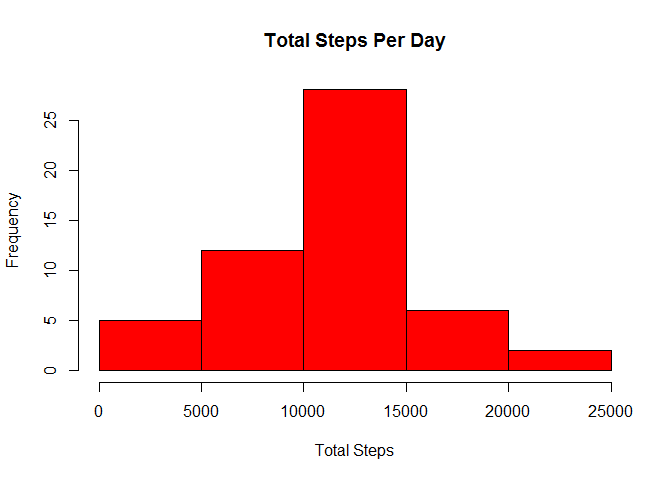
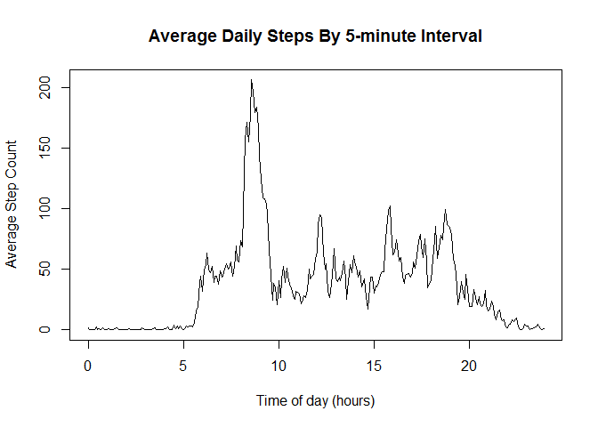
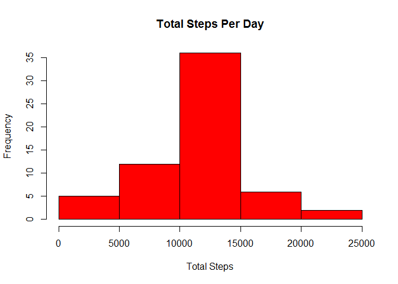
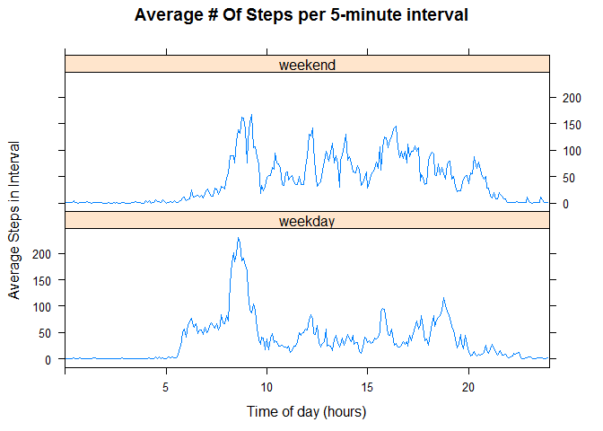

# Reproducible Research: Peer Assessment 1


## Loading and preprocessing the data
Download the data, unzip it and read it in, using setAs to interpret the dates in the correct format:

```r
    if (!file.exists("activity.csv"))
    {
        if (!file.exists("repdata-data-activity.zip"))
            download.file("http://d396qusza40orc.cloudfront.net/repdata%2Fdata%2Factivity.zip", "repdata-data-activity.zip")
        unzip("repdata-data-activity.zip")
    }

    toHours <- function(from)
    {
        fn = as.numeric(from);
        trunc(fn/100) + (fn %% 100)/60.0
    }

    setClass("activityDate")
    setAs("character", "activityDate", function(from) as.Date(from, format="%Y-%m-%d"))
    alldata <- read.csv("activity.csv", na.strings = "NA", colClasses = c('numeric', 'activityDate', 'numeric'))
```


## What is mean total number of steps taken per day?
First, we compute the total number of steps per day. There are 2 ways to do this. One way is to treat the NA values as zero. The other way is to ignore days that have NA sums.

```r
library(plyr)
totalByDayNASumAsZero = ddply(alldata, .(date), summarise, totalSteps = sum(steps, na.rm = TRUE))
totalByDayWithNA = ddply(alldata, .(date), summarise, totalSteps = sum(steps, na.rm = FALSE))
```

1. Histogram the total number of steps per day. If we ignore the days that sum as NA, we get the following histogram:

```r
library(plyr)
hist(totalByDayWithNA$totalSteps, xlab = "Total Steps", col = "red", main = "Total Steps Per Day")
```

 

2. We can calculate 2 different mean and median total number of steps depending on whether we treat NA days as having zero steps:

```r
summary(totalByDayNASumAsZero)
```

```
##       date              totalSteps   
##  Min.   :2012-10-01   Min.   :    0  
##  1st Qu.:2012-10-16   1st Qu.: 6778  
##  Median :2012-10-31   Median :10395  
##  Mean   :2012-10-31   Mean   : 9354  
##  3rd Qu.:2012-11-15   3rd Qu.:12811  
##  Max.   :2012-11-30   Max.   :21194
```

```r
summary(totalByDayWithNA)
```

```
##       date              totalSteps   
##  Min.   :2012-10-01   Min.   :   41  
##  1st Qu.:2012-10-16   1st Qu.: 8841  
##  Median :2012-10-31   Median :10765  
##  Mean   :2012-10-31   Mean   :10766  
##  3rd Qu.:2012-11-15   3rd Qu.:13294  
##  Max.   :2012-11-30   Max.   :21194  
##                       NA's   :8
```


If we assume an NA measurement means that zero steps were taken, then we get:  
Mean total steps per day: 9354  
Median total steps per day:10395  

On the other hand, if we assume an NA measurement simply has no data and not be counted, then we get:  
Mean total steps per day: 10766  
Median total steps per day: 10765  

## What is the average daily activity pattern?
1. We compute the average steps per interval across all the days (removing NA valeues from the calculation) and then plot the results:

```r
averageStepsPerInterval = ddply(alldata, .(interval), summarise, aveSteps = mean(steps, na.rm = TRUE))
plot(toHours(averageStepsPerInterval$interval), averageStepsPerInterval$aveSteps, type = "l", xlab = "Time of day (hours)", ylab = "Average Step Count", main = "Average Daily Steps By 5-minute Interval")
```

 

2. Which 5-minute interval on average across all the days in the dataset. contains the maximum number of steps?

```r
averageStepsPerInterval[which.max(averageStepsPerInterval$aveSteps),]
```

```
##     interval aveSteps
## 104      835 206.1698
```
The interval of 8:35am to 8:40am had the highest average steps.

## Imputing missing values
1. The number of rows with missing values is:

```r
sum(is.na(alldata$steps))
```

```
## [1] 2304
```
2. We will fill in the missing values by replacing the NAs with the average value for that interval over the rest of the days. First, we merge the alldata data frame with the averageStepsPerInterval frame based on the interval.

```r
modified <- merge(alldata, averageStepsPerInterval, by.x = "interval", by.y = "interval")
```

3. In the new data.frame we modify the steps column to use the original steps column if valid or the aveSteps column if steps is NA.

```r
modified$steps = ifelse(is.na(modified$steps), modified$aveSteps, modified$steps)
```

4. Now we calculate a new modifiedTotalByDay, histogram, and get the summary of the data to report the mean and median:

```r
modifiedTotalByDay = ddply(modified, .(date), summarise, totalSteps = sum(steps, na.rm = FALSE))
hist(modifiedTotalByDay$totalSteps, xlab = "Total Steps", col = "red", main = "Total Steps Per Day")
```

 

```r
summary(modifiedTotalByDay)
```

```
##       date              totalSteps   
##  Min.   :2012-10-01   Min.   :   41  
##  1st Qu.:2012-10-16   1st Qu.: 9819  
##  Median :2012-10-31   Median :10766  
##  Mean   :2012-10-31   Mean   :10766  
##  3rd Qu.:2012-11-15   3rd Qu.:12811  
##  Max.   :2012-11-30   Max.   :21194
```
The resultant mean and median step total per day are 10890 and 10931. These total step estimates are somewhat higher than when we did not impute the missing data.

## Are there differences in activity patterns between weekdays and weekends?
1. We can add a dayType factor variable to our data frame that stores whether the date is a weekday or weekend:

```r
modified$dayType = as.factor(ifelse(weekdays(modified$date) %in% c("Saturday", "Sunday"), "weekend", "weekday"))
```

2. Next we can average intervals using the dayType factor variable and plot the results:

```r
averageStepsPerDayTypeAndInterval = ddply(modified, .(interval, dayType), summarise, aveSteps = mean(steps, na.rm = FALSE))
summary(averageStepsPerDayTypeAndInterval)
```

```
##     interval         dayType       aveSteps      
##  Min.   :   0.0   weekday:288   Min.   :  0.000  
##  1st Qu.: 588.8   weekend:288   1st Qu.:  2.047  
##  Median :1177.5                 Median : 28.133  
##  Mean   :1177.5                 Mean   : 38.988  
##  3rd Qu.:1766.2                 3rd Qu.: 61.263  
##  Max.   :2355.0                 Max.   :230.378
```

```r
library(lattice)
xyplot(aveSteps ~ toHours(interval) | dayType, data = averageStepsPerDayTypeAndInterval, layout = c(1,2), xlab = "Time of day (hours)", ylab = "Average Steps in Interval", main= "Average # Of Steps per 5-minute interval", type="l")
```

 
